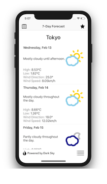

# Sky Forecast

Sky Forecast is a weather app showing the weather for a particular location.

### Description
User can choose between different forecast (current, 24hrs, 7Days) depending on what information they wanted to see.
User can choose any location from 20 different one to display. A favourite button is provided to load your favourite forecast
from a particular location upon re-opening the app.

### Screenshot

### API

This app uses the Dark Sky API. It is a weather API that allows the user to look up the weather from anywhere around the world.
For more information about this API, kindly visit their [website](https://darksky.net/dev)

### License

This app is available under the MIT License. See the [LICENSE](https://github.com/arvnq/SkyForecast/blob/master/LICENSE) for more info.

